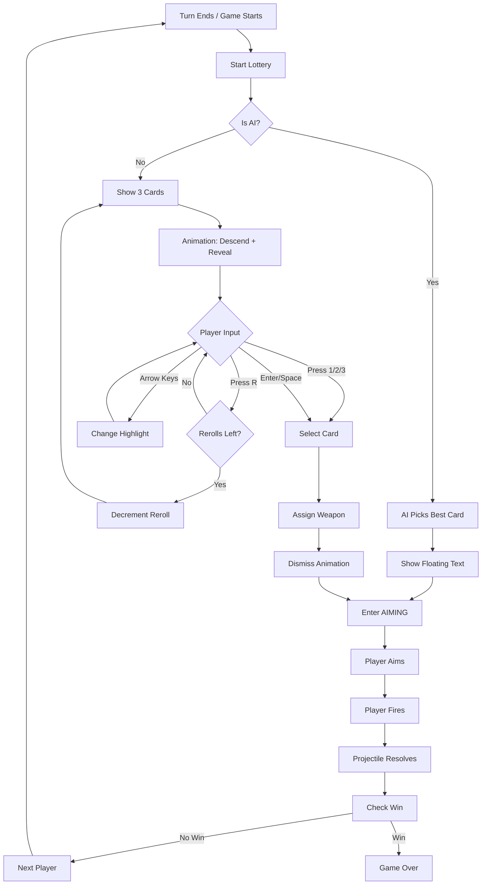

# VOID ARTILLERY: Cosmic Lottery Implementation Plan
## Technical Specification (v3.0)

This plan implements the Cosmic Lottery — a per-turn weapon selection system where players pick one of 3 cards and use that weapon for their turn.

---

## 1. System Overview

- **Trigger**: Every player turn, including Round 1 Turn 1
- **Flow**: `RESOLVING` → `LOTTERY` → `AIMING` → `FIRING` → `RESOLVING`
- **Ammo**: None — each weapon is 1 shot, pick determines THIS turn's weapon
- **Reroll**: 1 per player per game

---

## 2. Files to Modify

### src/main.js
- Add `lottery` state object
- Add `'lottery'` to phase handling
- Add `startLottery()`, `updateLottery()`, `renderLottery()`
- Modify turn transitions to always trigger lottery
- Remove all shop-related code

### src/weaponData.js
- Add `rarity` field to each weapon definition
- Or: Create `WEAPON_RARITY_MAP` constant

---

## 3. State Changes

### Add to Global State
```javascript
state.lottery = {
    active: false,
    cards: [],              // Array of 3 card objects
    selectedIndex: 0,       // Currently highlighted (0-2)
    animationPhase: 'none', // 'descending' | 'revealing' | 'selecting' | 'dismissing'
    animationTimer: 0,
    pityCounter: 0          // Turns since rare+ shown (global, not per-player)
};
```

### Add to Player Objects
```javascript
player.rerollsRemaining = 1;  // Per player, per game
```

### Remove (Shop State)
```javascript
// DELETE these:
state.shopOfferings
state.shopSelections
state.shopReady
state.shoppingPlayerIndex
```

---

## 4. Weapon Rarity Mapping

```javascript
const WEAPON_RARITY_MAP = {
    // COMMON (CHEAP tier) - 50%
    'BOUNCER': 'common',
    'DIRT_BALL': 'common',
    'DIGGER': 'common',
    'ROLLER': 'common',
    'PLASMA_BOLT': 'common',
    'SCATTER_SHELL': 'common',
    
    // UNCOMMON (MID tier) - 30%
    'MORTAR': 'uncommon',
    'SPLITTER': 'uncommon',
    'HEAVY_SHELL': 'uncommon',
    'DRILL': 'uncommon',
    'SEEKER': 'uncommon',
    'CLUSTER': 'uncommon',
    'GRAVITY_MORTAR': 'uncommon',
    'VOID_SPLITTER': 'uncommon',
    'BOUNCING_BETTY': 'uncommon',
    'FISSURE_CHARGE': 'uncommon',
    
    // RARE (PREMIUM tier) - 15%
    'QUAKE': 'rare',
    'TELEPORTER': 'rare',
    'SOLAR_FLARE': 'rare',
    'SINGULARITY_DRILL': 'rare',
    
    // EPIC (SPECTACLE tier) - 4%
    'NAPALM': 'epic',
    'CHAIN_LIGHTNING': 'epic',
    'METEOR_SHOWER': 'epic',
    'BLACK_HOLE_GRENADE': 'epic',
    'VOID_CANNON': 'epic',
    
    // LEGENDARY (ORBITAL tier) - 1%
    'NUKE': 'legendary',
    'RAILGUN': 'legendary',
    'ORBITAL_BEACON': 'legendary',
    'STRAFING_RUN': 'legendary'
    
    // EXCLUDED: DYING_STAR (special beacon reward only)
};

// Reverse lookup: get all weapons of a rarity
const WEAPONS_BY_RARITY = {
    common: ['BOUNCER', 'DIRT_BALL', 'DIGGER', 'ROLLER', 'PLASMA_BOLT', 'SCATTER_SHELL'],
    uncommon: ['MORTAR', 'SPLITTER', 'HEAVY_SHELL', 'DRILL', 'SEEKER', 'CLUSTER', 
               'GRAVITY_MORTAR', 'VOID_SPLITTER', 'BOUNCING_BETTY', 'FISSURE_CHARGE'],
    rare: ['QUAKE', 'TELEPORTER', 'SOLAR_FLARE', 'SINGULARITY_DRILL'],
    epic: ['NAPALM', 'CHAIN_LIGHTNING', 'METEOR_SHOWER', 'BLACK_HOLE_GRENADE', 'VOID_CANNON'],
    legendary: ['NUKE', 'RAILGUN', 'ORBITAL_BEACON', 'STRAFING_RUN']
};
```

---

## 5. Core Functions

### rollRarity()
```javascript
function rollRarity() {
    const roll = Math.random() * 100;
    if (roll < 1) return 'legendary';   // 1%
    if (roll < 5) return 'epic';        // 4%
    if (roll < 20) return 'rare';       // 15%
    if (roll < 50) return 'uncommon';   // 30%
    return 'common';                     // 50%
}
```

### generateLotteryCards()
```javascript
function generateLotteryCards() {
    let cards = [rollCard(), rollCard(), rollCard()];
    
    // Pity system: guarantee rare+ if 5 turns without one
    if (state.lottery.pityCounter >= 5) {
        const hasRarePlus = cards.some(c => 
            ['rare', 'epic', 'legendary'].includes(c.rarity)
        );
        if (!hasRarePlus) {
            // Upgrade lowest rarity card to rare
            const lowestIdx = cards.reduce((minIdx, card, idx, arr) => {
                const order = { common: 0, uncommon: 1, rare: 2, epic: 3, legendary: 4 };
                return order[card.rarity] < order[arr[minIdx].rarity] ? idx : minIdx;
            }, 0);
            cards[lowestIdx] = rollCardOfRarity('rare');
        }
    }
    
    // Update pity counter
    const hasRarePlus = cards.some(c => ['rare', 'epic', 'legendary'].includes(c.rarity));
    state.lottery.pityCounter = hasRarePlus ? 0 : state.lottery.pityCounter + 1;
    
    return cards;
}

function rollCard() {
    const rarity = rollRarity();
    return rollCardOfRarity(rarity);
}

function rollCardOfRarity(rarity) {
    const pool = WEAPONS_BY_RARITY[rarity];
    const weaponKey = pool[Math.floor(Math.random() * pool.length)];
    const weapon = WEAPONS[weaponKey];
    
    return {
        weaponKey,
        rarity,
        name: weapon.name,
        damage: weapon.damage,
        blastRadius: weapon.blastRadius,
        description: weapon.description
    };
}
```

### startLottery()
```javascript
function startLottery() {
    const player = getCurrentPlayer();
    
    // AI picks instantly
    if (player.isAI) {
        const cards = generateLotteryCards();
        const bestCard = aiSelectBestCard(cards);
        player.weapon = bestCard.weaponKey;
        
        // Show floating notification
        showAIPickNotification(player, bestCard);
        
        // Skip to aiming
        state.phase = 'aiming';
        return;
    }
    
    // Human player gets full lottery UI
    state.phase = 'lottery';
    state.lottery.active = true;
    state.lottery.cards = generateLotteryCards();
    state.lottery.selectedIndex = 0;
    state.lottery.animationPhase = 'descending';
    state.lottery.animationTimer = 0;
}
```

### selectCard()
```javascript
function selectCard(index) {
    const card = state.lottery.cards[index];
    const player = getCurrentPlayer();
    
    // Assign weapon for this turn
    player.weapon = card.weaponKey;
    
    // Play selection sound based on rarity
    playRaritySound(card.rarity);
    
    // Begin dismiss animation
    state.lottery.animationPhase = 'dismissing';
    state.lottery.animationTimer = 0;
}
```

### handleLotteryInput()
```javascript
function handleLotteryInput() {
    // Only process input during selection phase
    if (state.lottery.animationPhase !== 'selecting') return;
    
    const player = getCurrentPlayer();
    
    // Number keys for direct selection
    if (input.wasPressed('Digit1') || input.wasPressed('Numpad1')) {
        selectCard(0);
        return;
    }
    if (input.wasPressed('Digit2') || input.wasPressed('Numpad2')) {
        selectCard(1);
        return;
    }
    if (input.wasPressed('Digit3') || input.wasPressed('Numpad3')) {
        selectCard(2);
        return;
    }
    
    // Reroll
    if (input.wasPressed('KeyR') && player.rerollsRemaining > 0) {
        player.rerollsRemaining--;
        state.lottery.cards = generateLotteryCards();
        state.lottery.animationPhase = 'descending';
        state.lottery.animationTimer = 0;
        audio.playSelect();  // Or new reroll sound
        return;
    }
    
    // Arrow key navigation
    if (input.wasPressed('ArrowLeft')) {
        state.lottery.selectedIndex = Math.max(0, state.lottery.selectedIndex - 1);
        audio.playSelect();
    }
    if (input.wasPressed('ArrowRight')) {
        state.lottery.selectedIndex = Math.min(2, state.lottery.selectedIndex + 1);
        audio.playSelect();
    }
    
    // Confirm with Enter/Space
    if (input.wasPressed('Enter') || input.spaceReleased) {
        selectCard(state.lottery.selectedIndex);
    }
}
```

### updateLottery()
```javascript
function updateLottery(dt) {
    if (!state.lottery.active) return;
    
    state.lottery.animationTimer += dt * 1000;  // Convert to ms
    
    switch (state.lottery.animationPhase) {
        case 'descending':
            if (state.lottery.animationTimer >= 500) {
                state.lottery.animationPhase = 'revealing';
                state.lottery.animationTimer = 0;
            }
            break;
            
        case 'revealing':
            if (state.lottery.animationTimer >= 300) {
                state.lottery.animationPhase = 'selecting';
                state.lottery.animationTimer = 0;
            }
            break;
            
        case 'selecting':
            // Wait for player input (handled in handleLotteryInput)
            break;
            
        case 'dismissing':
            if (state.lottery.animationTimer >= 300) {
                state.lottery.active = false;
                state.lottery.animationPhase = 'none';
                state.phase = 'aiming';
            }
            break;
    }
}
```

### aiSelectBestCard()
```javascript
function aiSelectBestCard(cards) {
    // Priority: highest rarity, then highest damage
    const rarityOrder = { legendary: 5, epic: 4, rare: 3, uncommon: 2, common: 1 };
    
    return cards.reduce((best, card) => {
        if (rarityOrder[card.rarity] > rarityOrder[best.rarity]) return card;
        if (rarityOrder[card.rarity] === rarityOrder[best.rarity]) {
            if (card.damage > best.damage) return card;
        }
        return best;
    }, cards[0]);
}
```

### showAIPickNotification()
```javascript
function showAIPickNotification(player, card) {
    // Add to notifications array (render will handle display and fade)
    state.notifications = state.notifications || [];
    state.notifications.push({
        text: `${player.isAI ? 'AI' : 'P' + (state.currentPlayer + 1)} picked ${card.name}`,
        color: player.color,
        x: player.x,
        y: player.y - 50,
        timer: 1.5,  // Seconds to display
        rarity: card.rarity
    });
}
```

---

## 6. Rendering

### renderLottery()
```javascript
function renderLottery() {
    // Dim background
    renderer.drawRect(0, 0, CANVAS_WIDTH, CANVAS_HEIGHT, 'rgba(0,0,0,0.7)');
    
    // Title
    renderer.setGlow(COLORS.cyan, 20);
    renderer.drawText('INCOMING SALVAGE', CANVAS_WIDTH/2, 80, COLORS.cyan, 32, 'center', true);
    renderer.clearGlow();
    
    // Show current player
    const player = getCurrentPlayer();
    renderer.drawText(`PLAYER ${state.currentPlayer + 1}`, CANVAS_WIDTH/2, 115, player.color, 18, 'center', true);
    
    // Cards
    const cardWidth = 180;
    const cardHeight = 240;
    const spacing = 50;
    const totalWidth = cardWidth * 3 + spacing * 2;
    const startX = (CANVAS_WIDTH - totalWidth) / 2;
    const cardY = CANVAS_HEIGHT / 2 - 60;
    
    // Animation offset for descending
    let yOffset = 0;
    if (state.lottery.animationPhase === 'descending') {
        const progress = state.lottery.animationTimer / 500;
        yOffset = -300 * (1 - progress);
    }
    
    for (let i = 0; i < 3; i++) {
        const card = state.lottery.cards[i];
        const x = startX + i * (cardWidth + spacing);
        const y = cardY + yOffset;
        const isSelected = i === state.lottery.selectedIndex;
        
        // Only show cards after reveal
        const revealed = state.lottery.animationPhase !== 'descending';
        
        renderCard(card, x, y, cardWidth, cardHeight, isSelected, i + 1, revealed);
    }
    
    // Reroll indicator
    const rerolls = getCurrentPlayer().rerollsRemaining;
    const rerollText = rerolls > 0 ? `Reroll: ${rerolls} remaining (R)` : 'No rerolls left';
    const rerollColor = rerolls > 0 ? '#888' : '#444';
    renderer.drawText(rerollText, CANVAS_WIDTH/2, CANVAS_HEIGHT - 80, rerollColor, 16, 'center', false);
    
    // Controls hint
    renderer.drawText('Press 1, 2, or 3 to select', CANVAS_WIDTH/2, CANVAS_HEIGHT - 50, '#666', 14, 'center', false);
}

function renderCard(card, x, y, width, height, isSelected, number, revealed) {
    const rarityColors = {
        common: { border: '#666666', glow: '#888888', bg: '#1a1a1a' },
        uncommon: { border: '#00cc00', glow: '#00ff00', bg: '#0a1a0a' },
        rare: { border: '#0088ff', glow: '#00aaff', bg: '#0a0a1a' },
        epic: { border: '#aa00ff', glow: '#cc44ff', bg: '#1a0a1a' },
        legendary: { border: '#ffaa00', glow: '#ffdd00', bg: '#1a1a0a' }
    };
    
    const colors = revealed ? rarityColors[card.rarity] : rarityColors.common;
    
    // Card background
    renderer.drawRect(x, y, width, height, colors.bg);
    
    // Rarity border with glow
    if (isSelected) {
        renderer.setGlow(colors.glow, 25);
    }
    renderer.drawRectOutline(x, y, width, height, colors.border, isSelected ? 4 : 2, isSelected);
    renderer.clearGlow();
    
    if (!revealed) {
        // Card back
        renderer.drawText('?', x + width/2, y + height/2, '#444', 48, 'center', false);
        return;
    }
    
    // Rarity label
    renderer.drawText(card.rarity.toUpperCase(), x + width/2, y + 25, colors.border, 12, 'center', false);
    
    // Weapon name
    renderer.setGlow(colors.glow, 10);
    renderer.drawText(card.name, x + width/2, y + 60, '#ffffff', 20, 'center', true);
    renderer.clearGlow();
    
    // Stats
    renderer.drawText(`DMG: ${card.damage}`, x + width/2, y + 100, '#aaa', 14, 'center', false);
    renderer.drawText(`Radius: ${card.blastRadius}`, x + width/2, y + 120, '#aaa', 14, 'center', false);
    
    // Description (truncated)
    const desc = card.description.length > 30 ? card.description.slice(0, 27) + '...' : card.description;
    renderer.drawText(desc, x + width/2, y + 160, '#666', 11, 'center', false);
    
    // Selection number
    const numColor = isSelected ? '#fff' : '#444';
    renderer.drawText(`[${number}]`, x + width/2, y + height - 20, numColor, 18, 'center', isSelected);
}
```

---

## 7. Turn Flow Integration

### Modify advanceToNextPlayer() / endTurn()
```javascript
// In endTurn(), after resolution completes:
function transitionToNextTurn() {
    advanceToNextPlayer();
    
    // Always start lottery (no skip condition)
    startLottery();
}
```

### Update main update() loop
```javascript
function update(dt) {
    // ... existing code ...
    
    // Lottery phase
    if (state.phase === 'lottery') {
        updateLottery(dt);
        handleLotteryInput();
        return;  // Don't process other phases
    }
    
    // ... rest of update ...
}
```

### Update main render() loop
```javascript
function render() {
    // ... existing code ...
    
    // Lottery phase
    if (state.phase === 'lottery') {
        // Render game in background (dimmed)
        renderGame();
        renderLottery();
        return;
    }
    
    // ... rest of render ...
}
```

---

## 8. Player Initialization

### Modify createPlayers()
```javascript
function createPlayers(humanCount) {
    // ... existing code ...
    
    for (let i = 0; i < NUM_PLAYERS; i++) {
        state.players.push({
            // ... existing properties ...
            weapon: 'MORTAR',           // Initial weapon (will be replaced by first lottery)
            rerollsRemaining: 1,        // One reroll per player per game
            // Remove: weaponAmmo (not needed)
        });
    }
}
```

---

## 9. Cleanup Required

### Functions to REMOVE
- `enterShopPhase()`
- `generateShopOfferings()`
- `findNextShoppingPlayer()`
- `handleShopInput()`
- `advanceShopToNextPlayer()`
- `checkShopComplete()`
- `exitShopPhase()`
- `aiShopSelectFor()`
- `renderShop()`

### State to REMOVE
- `state.shopOfferings`
- `state.shopSelections`
- `state.shopReady`
- `state.shoppingPlayerIndex`

### Phase to UPDATE
- Change `'shop'` phase references to `'lottery'`

---

## 10. Flow Diagram



---

## 11. Implementation Checklist

### Phase 1: Core (MVP)
- [ ] Add `state.lottery` object
- [ ] Add `player.rerollsRemaining` in createPlayers()
- [ ] Create `WEAPON_RARITY_MAP` and `WEAPONS_BY_RARITY`
- [ ] Implement `rollRarity()`, `rollCard()`, `generateLotteryCards()`
- [ ] Implement `startLottery()` with AI instant-pick
- [ ] Implement `selectCard()`
- [ ] Implement `handleLotteryInput()`
- [ ] Implement basic `renderLottery()` (no animation)
- [ ] Wire into turn flow (replace shop trigger)
- [ ] Test: lottery appears, selection works

### Phase 2: Polish
- [ ] Implement `updateLottery()` animation phases
- [ ] Add descending animation
- [ ] Add reveal animation with rarity effects
- [ ] Add dismiss animation
- [ ] Add rarity-specific sounds
- [ ] Add AI notification floating text
- [ ] Add pity system
- [ ] Add reroll functionality

### Phase 3: Cleanup
- [ ] Remove all shop-related functions
- [ ] Remove shop state variables
- [ ] Update phase checks (shop → lottery)
- [ ] Test edge cases (death during lottery, etc.)
- [ ] Balance pass on rarity rates

---

*Document Version: 3.0*
*Last Updated: January 2026*
