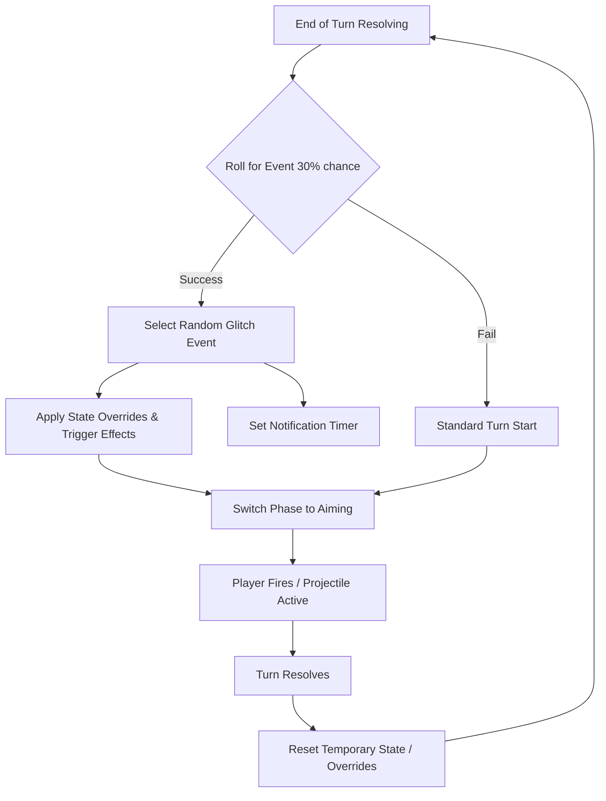

# GLITCH EVENTS — Implementation Plan

This plan details the implementation of a "Glitch Event" system for Void Artillery. These events introduce randomized gameplay modifiers at the start of a player's turn to increase unpredictability and excitement.

## 1. Architecture Overview

A new module `src/events.js` will handle the logic for selecting and executing events. The main game loop will hook into this system during turn transitions.



## 2. Event Registry (src/events.js)

The following events will be implemented:

- **ARSENAL GLITCH**: Current player's tank type is randomized for this turn only.
- **VOID WARP**: Teleports the active player to a new random X position on the terrain.
- **GRAVITY FLUX**: Sets gravity to a random value (e.g., 0.1 to 0.5) for one turn.
- **VOID ANOMALY**: Spawns a neutral projectile from the sky targeting a random spot on the map.
- **VOID SIPHON**: Steals 15 HP from the opponent and gives it to the active player.

## 3. Necessary Refactors (src/main.js)

- Change `GRAVITY` from a constant to `state.gravity` (initialized to 0.25).
- Add `activeEvent` object to global `state`: `{ name: '', timer: 0 }`.
- Modify `endTurn()` to include the event trigger logic within the `setTimeout` before `state.phase = 'aiming'`.
- Add a cleanup step at the end of `onExplode()` or `endTurn()` to revert temporary changes (like tank types or gravity).

## 4. Visuals & Feedback

- **Glitch Text**: Large, chromatic-aberration styled text in the center of the screen when an event triggers.
- **Screen Effects**: Flash the screen with a specific color (e.g., Magenta for Warp, Cyan for Siphon).
- **Audio**: A distinct "glitch" sound effect when an event is rolled.

---

# Claude Code Implementation Prompt

Copy and paste the following prompt into Claude Code to implement this system:

```text
Implement the "Glitch Event" system for Void Artillery as defined in GLITCH_EVENTS_PLAN.md.

Key tasks:
1. Create src/events.js:
   - Export an 'events' object with a 'trigger(state)' method.
   - Implement event logic for: ARSENAL GLITCH, VOID WARP, GRAVITY FLUX, VOID ANOMALY, and VOID SIPHON.
   - Use terrain.getHeightAt(x) for teleportation safety.

2. Update src/main.js:
   - Convert GRAVITY constant to state.gravity.
   - Update state to include 'activeEvent' (name and timer).
   - Hook into endTurn() to trigger events with a 30% chance.
   - Implement state cleanup (e.g., resetting tank types and gravity) when a turn completes.
   - Handle the 'VOID ANOMALY' projectile spawning using existing fireProjectile-like logic but as a neutral source.

3. Enhance src/renderer.js and main.js render():
   - Draw a glitchy notification when state.activeEvent.timer > 0.
   - Ensure the notification uses the neon aesthetic (glow/magenta/cyan).

Ensure all code follows the existing ES6 module pattern and matches the glow/shake/flash juice style.
```
