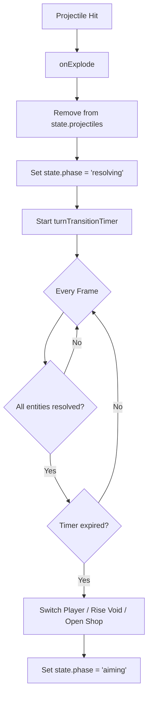

# Gemini Code Review & Stabilization Plan — Jan 23, 2026

## 1. Executive Summary
The current turn-management system is prone to "hanging" because it relies on fixed timers and phase-gated updates. When secondary projectiles (clusters, MIRVs) are active, they stop updating if the main phase transitions too early, or they trigger multiple `endTurn` calls that overlap.

## 2. Identified Issues

### A. The "Frozen Projectile" Bug
- **Cause**: `updateProjectile` and `updateClusterBomblet` are gated by `state.phase === 'firing'`. When the main shell hits, `onExplode` sets phase to `'resolving'`, instantly freezing any sub-munitions in the air.
- **Fix**: Allow projectile updates in both `'firing'` and `'resolving'` phases.

### B. Overlapping Turn Transitions
- **Cause**: `endTurn()` uses `setTimeout` to switch players. Multiple explosions in one turn trigger multiple `endTurn()` calls, creating race conditions for void-rise, coin awards, and player switching.
- **Fix**: Implement a `state.isTransitioning` flag and a centralized `state.turnTransitionTimer`.

### C. Inconsistent Weapon Termination
- **Cause**: Weapons like the Railgun or Orbital Strike use internal `setTimeout` calls to end turns rather than checking if the world is actually "quiet."
- **Fix**: Centralize all turn-ending logic into a single frame-by-frame check.

---

## 3. Implementation Steps

### Phase 1: State Machine Refactor
- Add `turnTransitionTimer: 0` and `isTransitioning: false` to `state`.
- Implement `checkAllProjectilesResolved()` in `src/main.js`:
    - Returns true only if `state.projectile` is null, `state.projectiles` is empty, `strafingRuns` are done, and `anomalyProjectiles` are gone.

### Phase 2: Logic Stabilization
- Update `update()` loop:
    - If `state.phase === 'resolving'`, decrement `state.turnTransitionTimer`.
    - Only call the actual player-switch logic when the timer reaches 0 AND `checkAllProjectilesResolved()` is true.
- Modify `endTurn()`:
    - Instead of a `setTimeout`, simply set `state.isTransitioning = true` and initialize the `turnTransitionTimer`.

### Phase 3: Weapon Logic Cleanup
- Remove all `setTimeout(..., endTurn)` calls from `fireRailgunBeam`, `fireDyingLight`, etc.
- Update `onExplode` to remove the calling projectile from its array *before* checking for resolution.

## 4. Mermaid Flow (Stabilized)

